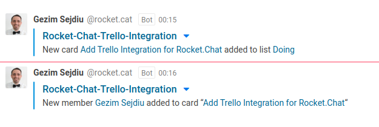

# Rocket.Chat-Trello-Integration
>Integration between Trello and Rocket.Chat: send Trello activity notifications to Rocket.Chat channels.



## How To
1. Create an incoming webhook in your RocketChat
   1. Go to **RocketChat-> Administration-> Integrations-> New Integration-> Incoming webhook**
   1. Set **"Enabled"** to **"True"**
   1. Give a name for the webhook (i.e "sda.tech-trello")
   1. Select the channel where you will receive the alerts (ex: #sda.tech-events). You may wish to create a dedicated channel for your notifications.
   1. Select an account from which the alerts will be posted (usually rocket.chat bot account is used).
   1. Set **"Script Enabled"** to **"True"**
   1. Paste [Trello.js](https://github.com/GezimSejdiu/Rocket.Chat-Trello-Integration/blob/master/Trello.js) inside the Script field.
   1. Save the integration. This will generate a webhook URL and secret for you.
   1. Use the generated **WebHook URL** to POST messages to Rocket.Chat
1. Go to [Trello's REST API](https://developers.trello.com/v1.0/reference) and enter your [Trello API Key](https://trello.com/app-key) and your Token to get started.
   1. After you have been connected to the Trello’s REST API you may wish to **Get /boards/{id}** which request a single board you are looking for, by providing the **ID** of the board as a parameter (Press **Try it** to get the result).
   1. Select `"id": "idModel"` of a board which you would like to create POST messages to Rocket.Chat.
   1. Go to **[Create Webhook](https://developers.trello.com/v1.0/reference#webhooks-2)** in the Trello’s REST API and add your WebHook URL (**callbackURL**), Board Id (**idModel**) and other parameters as below:
   ```javascript
   description : ”Trello-YourChannel-Webhook”
   callbackURL:  "WebHook URL"
   idModel: "ID of the model to be monitored"
   active: "true"
   ```
   1. Press **Try it** to make it works.
1. The integration is ready to generate notifications for the given Board :) Enjoy it!
